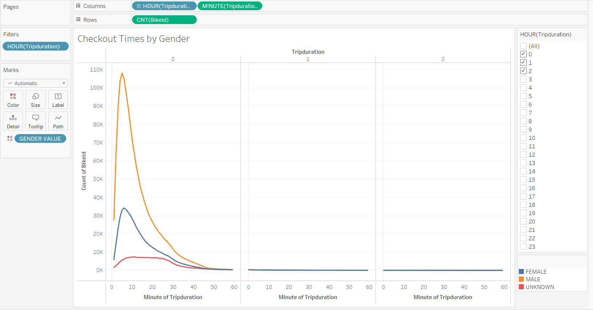
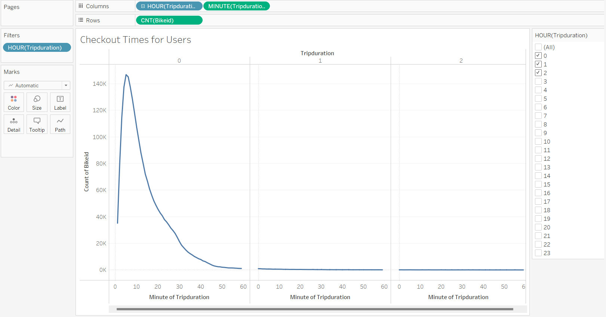

# Bikesharing with NYC CitiBike data

In this moduled I had the opportunity to perform an analysis of NYC CitiBike bikesharing data from August, 2019, with Tableau to propose a business
opportunity in Des Moines.

## Overview

I created the full Tableau Story and can be reviewed at this link [https://public.tableau.com/views/Module14ChallengeNYCCitiBike/Module14ChallengeNYCCitiBike?:language=en-US&publish=yes&:display_count=n&:origin=viz_share_link](https://public.tableau.com/views/Module14ChallengeNYCCitiBike/Module14ChallengeNYCCitiBike?:language=en-US&publish=yes&:display_count=n&:origin=viz_share_link)

The framework for this project was to analyze bikeshare data from CitiBike in New York City for presentation to investors looking to begin a bikeshare program in Des Moines, Iowa. While Des Moines is a long way away from the hustle and bustle of NYC, this analysis might help answer a few key questions:

* Who uses bikeshare programs?
* What area of a city sees the most bikeshare usage?
* What time of day are bikes used the most and the least?
* How much are the bikes used and by whom?

## Results

This breakdown of number of rides by duration, separated by gender, makes it even more apparent how many more rides are taken by male-identifying customers.

This graphing of number of trips by duration show that the vast majority of trips taken on CitiBike bikes are under an hour in length. More specifically, most trips are under a half-hour in length, with a swift dropoff in number of rides over an hour in length.

.png)
A heatmap also helps show weekly usage patterns. Once again we can see the heavy bike usage during weekday commute times, and weekend usage is spread throughout the middle of the day. An interesting anomaly is the relatively low bike usage during Wednesday's end-of-day commute. It could be useful to explore reasons for this (system outage, Wednesday holidays in August, something less obvious?), but it could just be an arbitrary anomaly. Also, we can still see that low-usage time in the early morning hours, every day of the week.

Lastly, this heatmap reinforces how much of the userbase is dominated by male-identifying, subscribing users. Why this is the case is unclear and warrants additional study.

There are one or two additional charts available in the Tableau analysis, but they tell pretty much the same story that has already been displayed above.

## Summary

In conclusion, bikeshare services are remarkably popular in busy metropolitan areas, where occupied real estate is densely packed and parking spaces may be scarce. The user base is made up mostly of male subscribers, providing regular income to the program. More outreach should be done to attract female riders, but male users seem a reliable market. And main usage seems focused around morning and evening commute times.

If I were to pursue additional lines of inquiry for analysis and visualization, given the data provided, I would explore:

* trip starting and ending locations during morning and evening rush hour time-windows, to display the flow of traffic between neighborhoods at peak hours;
* average trip duration, by birth year, by gender, to explore if there was any difference in male or female or un-gendered riders as they age.